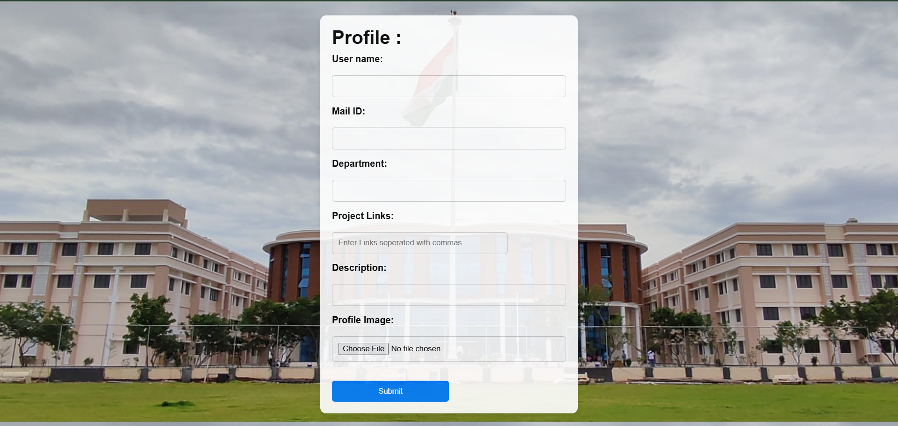
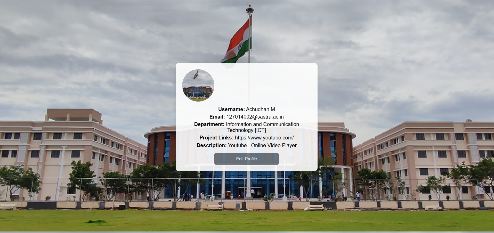
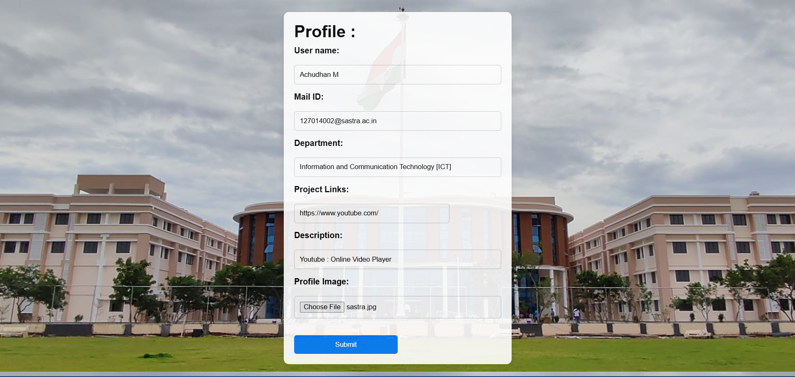

# Profile View Web App

This is a simple web application that allows users to create and view their profiles.
The application includes a form for inputting profile details such as username, email, department, project links, description, and a profile image.
Once the form is submitted, the profile details are displayed in a user-friendly format, and users can edit their profile if needed.

## Features

- Profile Form: Users can fill out their profile information using a structured form.
- Profile Display: The submitted profile is displayed with a preview of the uploaded image.
- Edit Profile: Users can return to the form and edit their profile details.
- Responsive Design: The layout adapts to different screen sizes for better usability.
- File Upload: Users can upload a profile image that will be displayed on their profile page.

## Technologies Used

- HTML: For structuring the webpage.
- CSS: For styling the form, profile display, and overall design.
- JavaScript: For form handling, data display, and interactive features.

## File Structure

```
|-- index.html          # Main HTML file for the app
|-- profile_view.css     # Stylesheet for the app
|-- profile_view.js      # JavaScript file for app functionality
|-- images/             # Directory for storing background and other images
```

## How to Run the Project

1. Clone this repository:
   ```bash
   git clone https://github.com/yourusername/profile-view-web-app.git
   ```

2. Navigate to the project folder:
   ```bash
   cd profile-view-web-app
   ```

3. Open the `index.html` file in your browser to view the app.

## Usage

1. Fill out the form with your details:
   - Enter your username, email, department, and project links (separated by commas).
   - Provide a short description.
   - Upload a profile image.
2. Click the submit button to view your profile.
3. To edit your profile, click the "Edit Profile" button.

## Screenshot

### 1. Profile Form
This screenshot shows the form where users can input their details:


---

### 2. Profile View
This screenshot displays the submitted profile details:


### 3. Edit Mode
This screenshot shows how users can return to the form to edit their details:

---


---
Author: Achudhan M  
Acknowledgments: This project was built to explore basic web app functionalities.
```
